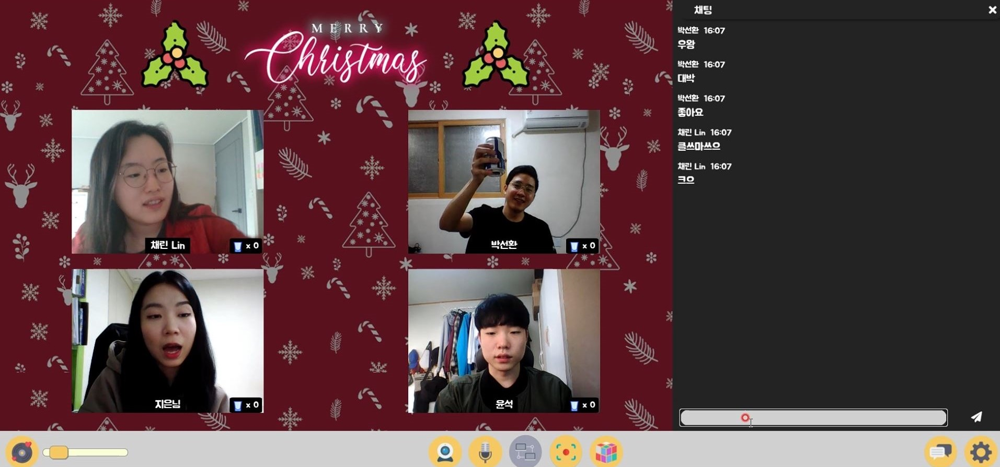
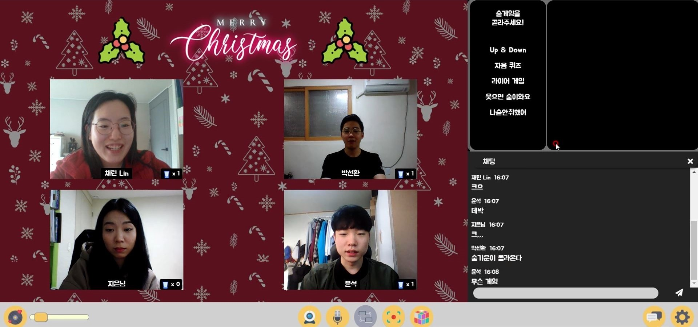
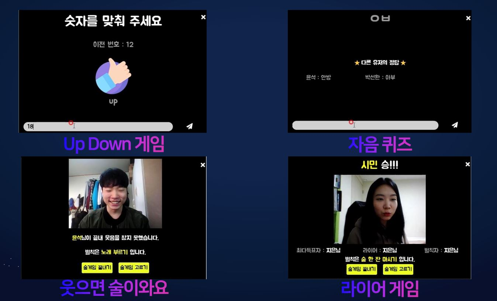
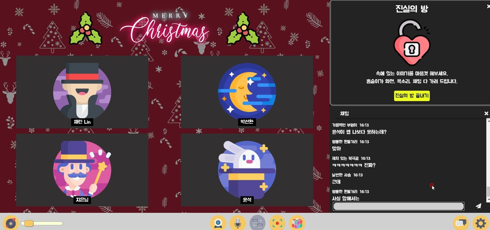
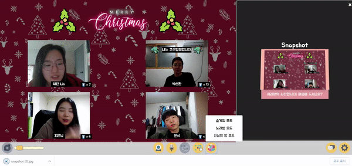
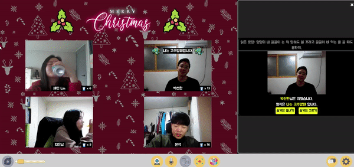
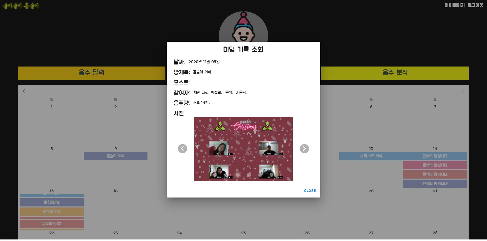
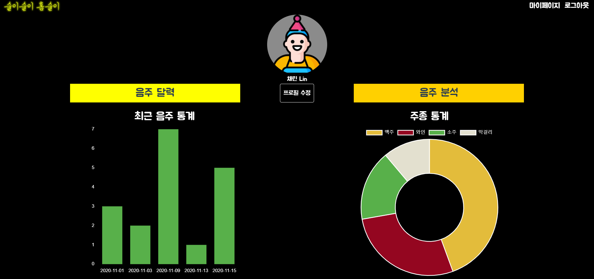

<br>


# 🥂술이술이홈술이

화상 기반 랜선 술자리 플랫폼

<br>

## 👨‍👩‍👦팀원 소개
**Sun Hwan Park**

- 🧙‍♂️Github: [@SunHwan-Park](https://github.com/SunHwan-Park)

**Chae Lin Shin**

- 🍒Github: [@scl2589](https://github.com/scl2589)

**Ji Eun Chae**

- 🐶Github : [@jieunchae](https://github.com/jieunchae)

**Yoon Seok Cha**

- 🌰Github: [@C9Boom7](https://github.com/c9boom7)

<br>

## 📆 프로젝트 개요

</img>
</img>
</img>
</img> 
</img>
</img>

- **진행 기간**: 2020.10.12  ~ 2020.11.27

- **목표**
  - 온라인으로 서로 소통하며 음주를 즐길 수 있는 AI 기반 화상 술자리 서비스를 개발합니다.
  - 온라인 화상으로도 술자리의 즐거운 분위기를 충분히 느낄 수 있도록 UX/UI를 설계해 사용자의 만족도를 높이고, 지속적으로 방문 사용할 수 있도록 유도합니다.
  - 사용자의 건전하고 건강한 음주 문화를 장려하기 위한 기능을 지원합니다.

- **✨3가지 가치**
  - **흥**
    - 코로나 사태로 굉장히 제한되고, 갑갑한 일상을 살아가는 사람들에게 익숙하지만 또 새로운 즐거움을 제공할 수 있습니다.
  - **연결**
    - 사회적 활동이 극단적으로 축소된 상황에서 사람들을 연결해 고립감과 외로움을 해소할 수 있습니다.
  - **새로운 음주문화**
    - 최근 주목받고 있는 랜선술자리를, 단순히 일시적인 사회 현상에 그치지 않고, 포스트 코로나 시대의 새로운 음주문화로 자리매김할 수 있는 환경을 제공합니다.

- **✏기획서**
  - <a href="Documentation/Proposal/서울5반A503_Proposal.docx">기획안</a>
  - <a href="Documentation/Presentation/1023_자율프로젝트_중간발표_최종.pdf">기획발표 pdf</a>

- **🖼와이어프레임**
  - <a href="https://lab.ssafy.com/s03-final/s03p31a503/tree/master/Documentation/WireFrame">와이어프레임 확인하기</a>
- **🎬프로젝트 시연영상**
  - <a href="https://youtu.be/4IB_dOKe60E">시연영상</a>
<br>

## ✍ 프로젝트 소개
**술이술이홈술이**는 *온라인으로 술자리를 즐길 수 있는 화상 기반 랜선 술자리 플랫폼*입니다. 

코로나 19 바이러스의 대유행 속에서 우리는 아직 불편하고 조심스러운 삶을 살아가고 있습니다. 직접 사람들을 만나 함께 술을 마시기 어려운 요즘, "랜선 술자리"는 빠르게 주목 받고 있습니다. 실제로 코로나 바이러스가 유행한 이후, "랜선 술자리"에 대한 언급도 급증하기도 했습니다. 이렇게 랜선 술자리에 대한 사람들의 니즈가 커져가는 가운데, Zoom, Webex 와 같은 '비즈니스 회의' 중심의 플랫폼은 술자리를 즐기기엔 다소 딱딱합니다. 그래서 온라인으로 소통하며 음주를 즐길 수 있는 '엔터테인먼트' 중심의 화상 기반 랜선 술자리 플랫폼, **술이술이홈술이**를 개발하였습니다.

**술이술이홈술이**는  술자리 분위기를 제대로 느낄 수 있도록 술자리 테마와 음악 공유가 가능합니다. 같은 음악과 테마를 공유하며 사용자들이 한 곳에서 술자리에 있을 수 있습니다.  또한, 술자리에서 빠지면 안되는 '재미 요소'를 추가하였습니다. 사용자들이 술자리를 즐길 수 있도록 5종의 온라인 술게임부터 노래방 기능, 스냅샷 기능, 그리고 취중진담을 위한 진실의 방 모드까지 다양한 기능을 지원합니다. 이를 통해 사용자가 술이술이홈술이에서도 지루할 틈 없이 술자리를 즐길 수 있도록 하였습니다. 더불어 술이술이홈술이는 건전한 술문화를 장려합니다. 본인이 얼마나 마셨는지 확인할 수 있는 주량 체크 기능과, 사용자의 주취여부를 파악해주는 나술안취했어 기능이 포함되어 있습니다. 이외에도, 사용자의 술자리 기록을 마이페이지의 캘린더와 통계를 통해 한 눈에 확인할 수 있습니다.

**술이술이홈술이**에서 안전하고 즐거운 술자리를 가져보면 어떨까요? **술이술이홈술이**가 새로운 술문화를 선도합니다.


<br>

## ⭐️주요 기능

### 술자리 맞춤형 화상 서비스

> 홈술이는 사용자들이 서로 떨어져 있지만, 같은 술자리 분위기를 공유하며 느낄 수 있게 하는 기능을 제공합니다.

- 상황별, 시즌별 다양한 테마
  - 
  - 기본 테마 뿐만 아니라 크리스마스, 생일, 봄 테마를 지원하여 술자리의 분위기를 낼 수 있도록 합니다.
- 또한 모두가 BGM을 공유하는 기능을 제공합니다.

### 즐거운 술자리

> 홈술이에는 화상 기반 술자리 서비스만이 제공할 수 있는 여러 '재미요소'가 포함되어 있습니다.

- 술게임 모드
  - 
  - 
  - 온라인으로도 원활하게 술게임을 진행할 수 있도록 지원합니다.
  - 술게임은 다음과 같이 총 5종의 술게임을 제공합니다.
    - **Up Down 게임**: 특정 숫자를 유추합니다.
    - **자음퀴즈**: 주어진 자음 (초성)에 맞게 단어를 선착순으로 입력합니다.
    - **웃으면 술이와요**: 웃음을 참으며 특정 단어를 돌아가면서 순서대로 말합니다.
    - **라이어게임**: 주어진 주제와 단어에 따라 거짓말을 하는 사람을 찾아냅니다.
    - **나술안취했어**: STT를 사용하여 사용자가 발음한 문장과 주어진 문장 간의 정확도를 검증해 사용자의 주취 여부를 판단합니다.
- 진실의 방 모드
  - 
  - 사용자의 화면을 숨기고, 음성을 변조할 뿐만 아니라 익명 채팅으로 전환하여 사용자들이 속마음을 털어놓을 수 있도록 온라인 취중진담을 지원합니다.
- 스냅샷
  - 
  - 즐거운 술자리 모습을 사진으로 남길 수 있습니다.

### 건전한 술자리

> 홈술이는 책임질 수 있는 술자리, 건전한 술자리를 장려합니다.

- '나 술 안취했어' 기능
  - 
  - 사람들의 취기를 검증할 수 있게 해주는 기능입니다.
  - 사용자는 최대한 올바른 발음으로 해당 문장을 읽고, 서비스는 STT 기술을 활용해, 사용자가 발음한 문장과 주어진 문장 간의 정확도를 검증합니다.

- 음주 내역을 기록할 수 있는 기능
  - 
  - 음주량이 기존에 설정해 둔 본인의 주량을 넘어선다면, 경고 메시지를 띄워 사용자의 지나친 음주를 예방합니다.
  - 
  - 음주 달력을 통해 술자리의 정보를 확인 할 수 있습니다.
  - 
  - 음주 분석을 통해 음주 습관을 점검 할 수 있습니다.

<br>

## :grey_question: 서비스 아키텍쳐


<br>

<br>

## :yum: Installation

- Frontend

```shell
cd frontend
npm i
npm run serve
```

- Backend

```shell
cd Backend

cd API
./gradlew build -Pprofile=prod
◦sudo java -jar -Dspring.profiles.active=prod homesool-0.0.1.jar

cd ../openvidu/openvidu-server
◦mvn -Dopenvidu.url=https://k3a503.p.ssafy.io:4443/ package exec:java

cd ../API
conda create --name <env> --file requirements.txt
conda activate <env>
python app.py
```

<br>

## :yum: 개발 환경 및 IDE

- Java : jdk11 (11.0.9.1)
- Docker : 19.03.13 
- node.js : 8.10.0
- maven : Apache Maven 3.6.0
- openvidu : 2.15.1

<br>

## :baby_chick: Server Description

- port (nginx)

  - | 443  | server default(https)                  |
    | ---- | -------------------------------------- |
    | 80   | server default(http) (redirect to 443) |
    | 4443 | openvidu (Spring boot running)         |
    | 8889 | REST API (Spring boot running)         |
    | 5000 | AI (Flask running)                     |
    | 8081 | Jenkins                                |


## 🎞 최종산출물

<a href="https://www.youtube.com/watch?v=4IB_dOKe60E&feature=youtu.be">서울 5반 발표 시연영상</a>
<br>
<a href="Documentation/Presentation/1116_자율프로젝트_서울5반_최종발표.pdf">최종발표 pdf</a>


