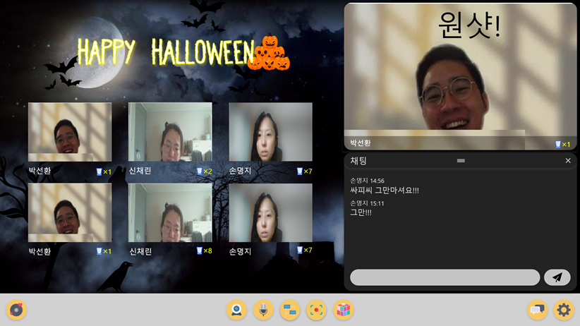
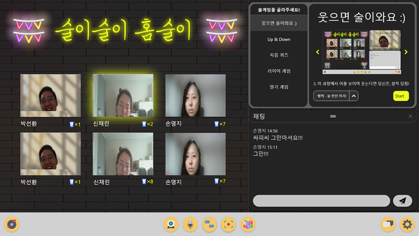
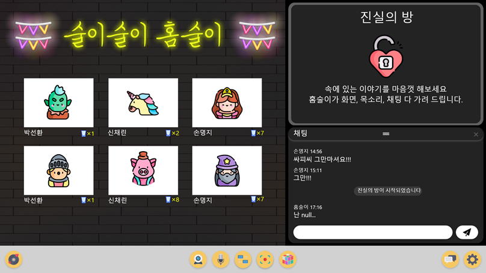
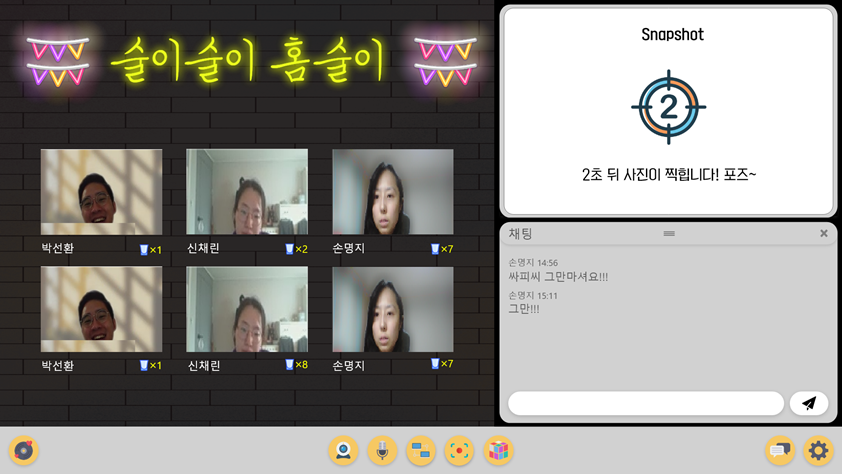
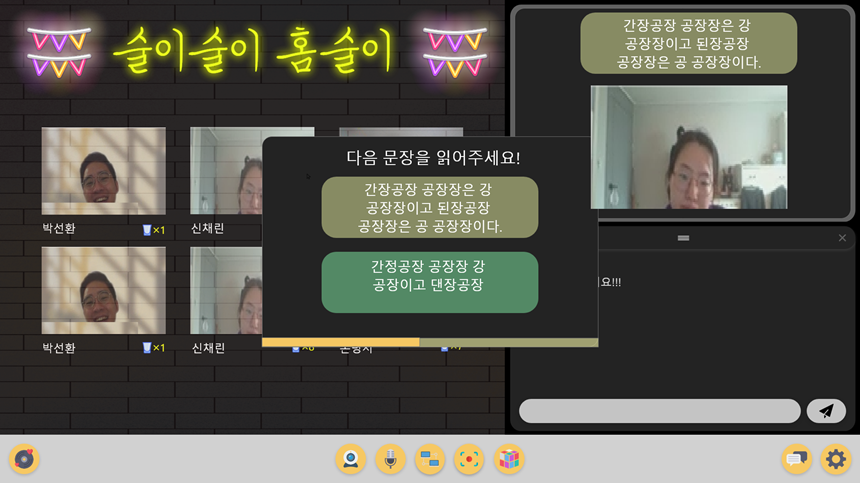
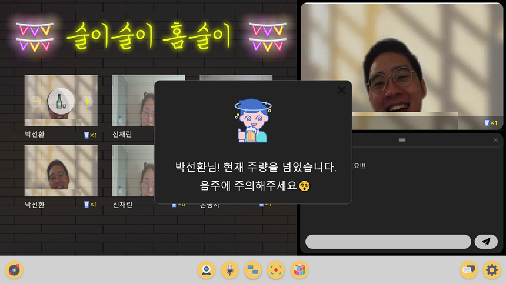

# 술이술이홈술이

## 👨‍👩‍👦팀원 소개

**Chae Lin Shin**

- 🍒Github: [@scl2589](https://github.com/scl2589)

**Myeong Ji Son**

- 🚀Github: [@ji-exitosa](https://github.com/ji-exitosa)

**Sun Hwan Park**

- 🧙‍♂️Github: [@SunHwan-Park](https://github.com/SunHwan-Park)

**Ji Eun Chae**

- 🐶Github : [@jieunchae](https://github.com/jieunchae)

**Yoon Seok Cha**

- 🌰Github: [@C9Boom7](https://github.com/c9boom7)

 

## 📆 프로젝트 개요

- **진행 기간**: 2020.10.12  ~ 2020.11.27

- **목표**
  - 온라인으로 서로 소통하며 음주를 즐길 수 있는 AI 기반 화상 술자리 서비스를 개발한다.
  - 온라인 화상으로도 술자리의 즐거운 분위기를 충분히 느낄 수 있도록 UX/UI를 설계해 사용자의 만족도를 높이고, 지속적으로 방문 사용할 수 있도록 유도한다.
  - 사용자의 건전하고 건강한 음주 문화를 장려하기 위한 기능을 지원한다.

 

## ✨프로젝트 가치

> 3가지 가치를 통해 화상 기반 랜선 술자리 플랫폼 구현

- **흥**
  - 코로나 사태로 굉장히 제한되고, 갑갑한 일상을 살아가는 사람들에게 익숙하지만 또 새로운 즐거움을 제공할 수 있습니다.
- **연결**
  - 사회적 활동이 극단적으로 축소된 상황에서 사람들을 연결해 고립감과 외로움을 해소할 수 있습니다.
- **새로운 음주문화**
  - 최근 주목받고 있는 랜선술자리를, 단순히 일시적인 사회 현상에 그치지 않고, 포스트 코로나 시대의 새로운 음주문화로 자리매김할 수 있는 환경을 제공합니다.

 

## ⭐️ 주요 기능

### 술자리 맞춤형 화상 서비스

> 홈술이는 사용자들이 서로 떨어져 있지만, 같은 술자리 분위기를 공유하며 느낄 수 있게 하는 기능을 제공합니다.

- 상황별, 시즌별 다양한 테마 제공
  - 
- 모두가 동시에 공유하는 BGM 제공

### 즐거운 술자리

> 홈술이에는 화상 기반 술자리 서비스만이 제공할 수 있는 여러 '재미요소'가 포함되어 있습니다.

- 술게임 모드 제공
  - 
  - 온라인으로도 원활하게 술게임을 진행할 수 있도록 지원합니다.
- 진실의 방 모드 제공
  - 
  - 온라인 취중진담을 지원합니다.
- 스냅샷
  - 
  - 즐거운 술자리 모습을 사진으로 남길 수 있습니다.

### 건전한 술자리

> 홈술이는 책임질 수 있는 술자리, 건전한 술자리를 장려합니다.

- '나 술 안취했어' 기능 제공
  - 
  -  사람들의 취기를 검증할 수 있게 해주는 기능입니다.
  - 용자는 최대한 올바른 발음으로 해당 문장을 읽고, 서비스는 STT 기술을 활용해, 사용자가 발음한 문장과 주어진 문장 간의 정확도를 검증합니다.

- 데시벨 체크 기능 제공
  - 너무 큰 목소리로 이야기 할 경우, 주변 소음공해 방지를 위해 경고 메시지 띄워줍니다.
- 음주 내역을 기록할 수 있는 기능 제공
  - 
  - 음주량이 기존에 설정해 둔 본인의 주량을 넘어선다면, 경고 메시지를 띄워 사용자의 지나친 음주를 예방합니다.

 

## 서비스 아키텍쳐

 

## 🖼와이어프레임
[Wireframe](./Documentation/Wireframe/술이술이홈술이_wireframe.pdf)

 

## ✍ Ground Rule

* 1일 1 commit

* merge 후 브랜치 지우기

 

## 🤝 Branch Rule

* Git Branch 전략

* Commit Rule : [JIRA 이슈번호] 타입/브랜치명 : 행위단위 내용  
  ex) [S03P31A503-8] docs/master : Add erd diagram

 